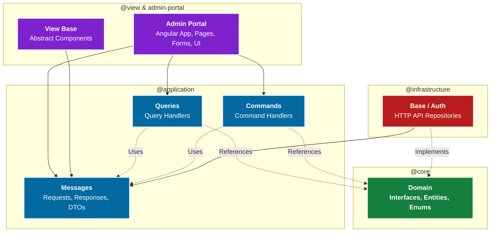

# The Curated Emerald - Enterprise Admin Portal

Welcome to the cutting-edge administrative nerve center for **The Curated Emerald** (formerly Handmade Shop). This project demonstrates an enterprise-grade frontend architecture, built entirely on **Angular 18+** using strict **Clean Architecture**, **Domain-Driven Design (DDD)**, and the **CQRS (Command Query Responsibility Segregation)** pattern.

The system is engineered for large-scale application development, ensuring pure separation of concerns across multiple decoupled library layers within a Lerna/Nx-style Monorepo.

---

## 🏗️ Architectural Blueprint (Clean Architecture)

Our Frontend is heavily modularized to guarantee maintainability and scalability. Dependencies strictly point **INWARD** toward the core domain.



### Module Breakdown:
- **`@core/domain`**: The Heart. Defines the absolute truths of the business (e.g., `InterfaceCategoryReadableRepository`). Entirely agnostic to HTTP, frameworks, or UI.
- **`@application/messages`**: Data Transfer Objects (DTOs). Defines strict requests/responses boundaries. Data is mapped via robust decorators (`@propertyMapper`).
- **`@application/commands & queries`**: The CQRS implementation. Houses injectable handlers that isolate and execute specific use cases.
- **`@infrastructure/base`**: The Implementers. Contains services like `CategoryWriteableRepository` that utilize `HttpClient` to communicate with external microservices.
- **`@view & admin-portal`**: The Application layer. Leverages NextGen Angular features (Signals, Standalone Components, Reactive Forms) for creating a highly reactive Admin Dashboard UI.

---

## 🚀 Key Technical Features

- **CQRS Pattern Built-in**: Complete segregation of Reads (`Queries`) from Writes (`Commands`), opening the door to highly scalable optimization paths and isolated testing on both frontend and backend.
- **Advanced State & Data Flow**: Utilizes Angular Signals for granular, glitch-free reactivity and optimized change detection without relying heavily on RxJS subscriptions.
- **Robust Authentication & Authorization**: Interceptors (`AuthorizationTokenInterceptor`) tightly control JWT-based access, integrating deeply with backend workflows.
- **Premium Design System ("Curated Emerald")**: A bespoke UI framework leveraging specialized CSS tokens, glassmorphism, dynamic grids, and Google's Material Symbols.

---

## 📦 Setting Up & Running 

This workspace is managed using npm workspaces and the Angular CLI.

1. **Install Dependencies**
   ```bash
   npm install
   ```

2. **Build Library Pipelines**
   Due to the deep modular design, cross-dependencies must be built through our custom Directed Acyclic Graph (DAG) scripts before starting the main portal:
   ```bash
   npm run build:lib:all
   ```
   *(This ensures `ng-packagr` compiles `@core` first, cascading cleanly up to the `@view` layers)*

3. **Start the Admin Portal**
   ```bash
   npm start
   ```
   *(The portal will be served locally on http://localhost:4800)*

---
*Code explicitly engineered to remain clean, scalable, completely testable, and beautifully isolated.*
