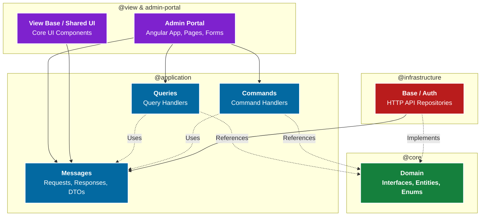

# The Curated Emerald - Enterprise Admin Portal (Back Office)

Welcome to the cutting-edge administrative nerve center for **The Curated Emerald**. This project demonstrates an enterprise-grade back-office architecture built entirely on **Angular 18+**, **TypeScript**, and **RxJS**, designed specifically for high scalability, maintainability, and top-tier performance.

This system is engineered utilizing strict **Clean Architecture**, **Domain-Driven Design (DDD)**, and the **CQRS (Command Query Responsibility Segregation)** pattern within a highly modularized monorepo workspace.

---

## 🏗️ Architectural Blueprint & Module Architecture

Our Frontend is heavily modularized to guarantee maintainability for large-scale back-office systems. Dependencies strictly point **INWARD** toward the core domain.



### Module Breakdown (Dependency Injection & Encapsulation):
- **`@core/domain`**: The Heart. Defines the absolute truths of the business. Agnostic to HTTP or UI variables.
- **`@application`**: Data Transfer Objects (DTOs) and CQRS Implementations. Defines strict request/response data shapes.
- **`@infrastructure/base`**: The Implementers. Communicates with backend REST APIs via Angular's `HttpClient`.
- **`@view & admin-portal`**: The Application layer. Contains the shared Core UI libraries, reusable design system components, and main routing.

---

## 🚀 Key Engineering & Performance Standards

This project is built to align with elite standards for Large-scale Front-end Engineering:

- **Advanced Angular Mastery**: Extensive use of **TypeScript**, **RxJS** for reactive data streams, deep understanding of the Angular lifecycle, and hierarchical **Dependency Injection (DI)**.
- **Performance Optimization**: Explicitly optimized for speed using **Lazy Loading**, precise **Change Detection** strategies (`OnPush`, Angular Signals), and aggressive **bundle size optimization**.
- **REST APIs & Auth Integration**: Deep integration with backend RESTful APIs, securing routes and data flow using **JWT / OAuth2** token mechanisms via HTTP Interceptors.
- **Reusable Shared UI System**: Creation of a scalable, maintainable "Curated Emerald" Design System (Core UI) combining **SCSS/CSS**, responsive design principles, and standalone components.
- **CQRS Pattern Built-in**: Complete segregation of Reads (`Queries`) from Writes (`Commands`), ensuring decoupled and highly cohesive state flows.

---

## 📦 Setting Up & CI/CD Pipelines

This workspace is managed using npm workspaces, designed similarly to an Nx/Lerna monorepo approach optimized for continuous integration (CI/CD) pipelines.

1. **Install Dependencies**
   ```bash
   npm install
   ```

2. **Build Shared Libraries (Pipeline Prerequisite)**
   Due to the rigid modular design, cross-dependencies must be built through our custom Directed Acyclic Graph (DAG) scripts before starting the main portal:
   ```bash
   npm run build:lib:all
   ```
   *(This ensures `ng-packagr` compiles `@core` first, cascading cleanly up to the `@view` UI libraries)*

3. **Start the Back Office Portal**
   ```bash
   npm start
   ```
   *(The portal will be served locally on http://localhost:4800)*

---
*Code explicitly engineered to remain clean, scalable, completely testable, and aligned with Senior Engineering standards.*
